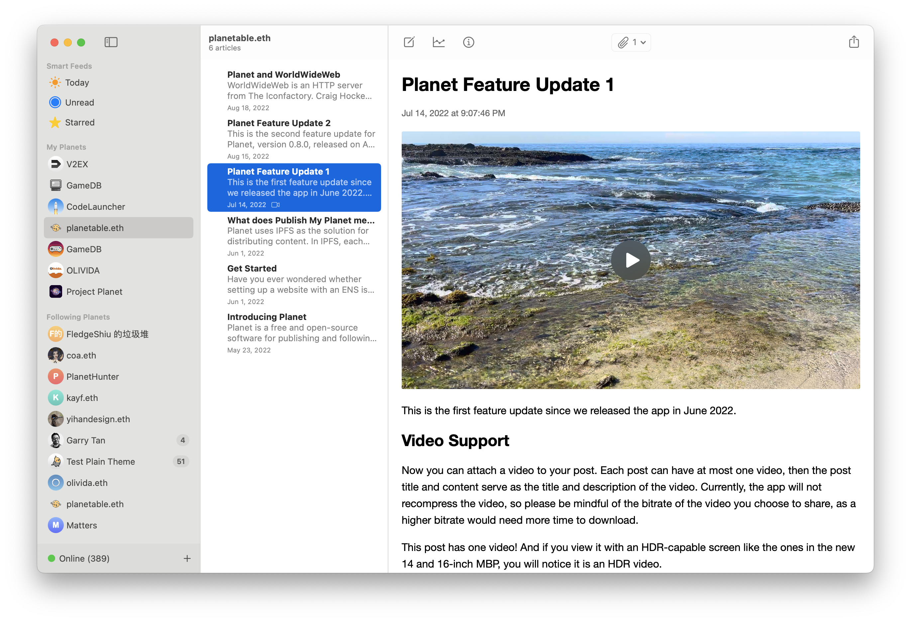
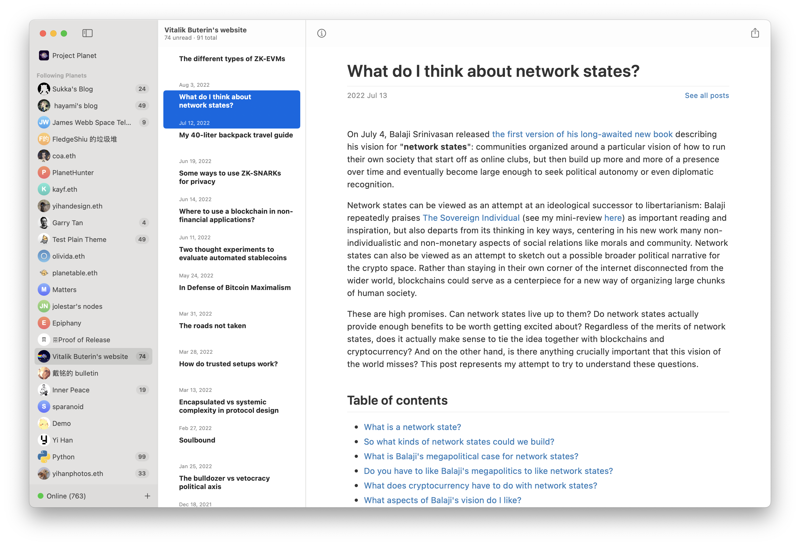

# Planet

Planet is a free and open-source software for publishing and following web content, and it does not require a centralized server or service. It uses IPFS to achieve peer-to-peer content distribution. Furthermore, you can link your content to an Ethereum Name (.eth) so that others can follow you via Planet by the .eth name. Since both IPFS and ENS are decentralized, you can build your websites or follow others, all in a decentralized manner.



## Features

- Build a blog and publish it to IPFS
- Built-in local IPFS node
- Generate an IPNS that is ready to be set as [EIP-1577](https://eips.ethereum.org/EIPS/eip-1577) ENS contenthash
- Pinning content when following, make content usable offline
- Follow the updates of websites running on ENS, NFT avatar as site icon is supported
- Markdown editor with live preview
- Attach video, audio, or any format of files
- Star or share posts
- Global audio player
- Template browser for managing and building templates
- Integration with [WorldWideWeb](https://apps.apple.com/us/app/worldwideweb-desktop/id1621370168?mt=12) for previewing sites built with Planet
- Integration with Plausible.io for traffic analytics, example: [plausible.io/planetable.eth.limo](https://plausible.io/planetable.eth.limo)
- Export/Import website
- RSS reader, all three formats, RSS, Atom, and JSON Feed, are supported
- Sandboxed native macOS app created with SwiftUI 3

## Sites Using Planet

If you would like to add your site to this list, please share it in a [discussion](https://github.com/Planetable/Planet/discussions). We can't wait to see your creations!

- [planetable.eth](https://planetable.eth.limo)
- [olivida.eth](https://olivida.eth.limo)
- [yihanphotos.eth](https://yihanphotos.eth.limo)
- [gamedb.eth](https://gamedb.eth.limo)
- [zh.gamedb.eth](https://zh.gamedb.eth.limo)

Planet can follow any ENS with a [EIP-1577](https://eips.ethereum.org/EIPS/eip-1577) contenthash. If your site has RSS, Planet can read it too. For example, vitalik.eth:



## Backup

Before you try this app out, please be advised that it is still at an early stage, and many changes happen. So we recommend you backup your data, especially your IPNS key, from time to time. When you use `Export Planet`, it will include your IPNS key.

## Build the macOS App

Git LFS is required for working with this code base. You can install git-lfs with Homebrew:

```
brew install git-lfs
```

Then activate it in the project folder:

```
git lfs install
```

[GitHub Desktop](https://desktop.github.com) has built-in Git LFS support, so we recommend using it to check out the project if you are unsure about the installation status of Git LFS.

If Kubo binaries are only 133 bytes on disk, please ensure you have activated git-lfs for the project folder.

A `pre-commit.sh` script is provided in the `git-hooks` folder for sync build number with git commits count.

To use your own build config for setting `DEVELOPMENT_TEAM`, please create a `local.xcconfig` file alongside the `Planet.xcconfig` file.

The following configuration variables can be overridden:

- DEVELOPMENT_TEAM
- CODE_SIGN_STYLE
- ORGANIZATION_IDENTIFIER_PREFIX

## Build Instructions

https://planetable.eth.limo/build-instructions/

## Privacy Policy

The development team collects no information from the app. The app runs entirely in a sandbox and does not have access to any data outside of the sandbox unless explicitly granted. The app also does not use any third-party analytics or tracking services.

## License

Licensed under the [MIT license](https://github.com/Planetable/Planet/blob/main/LICENSE).