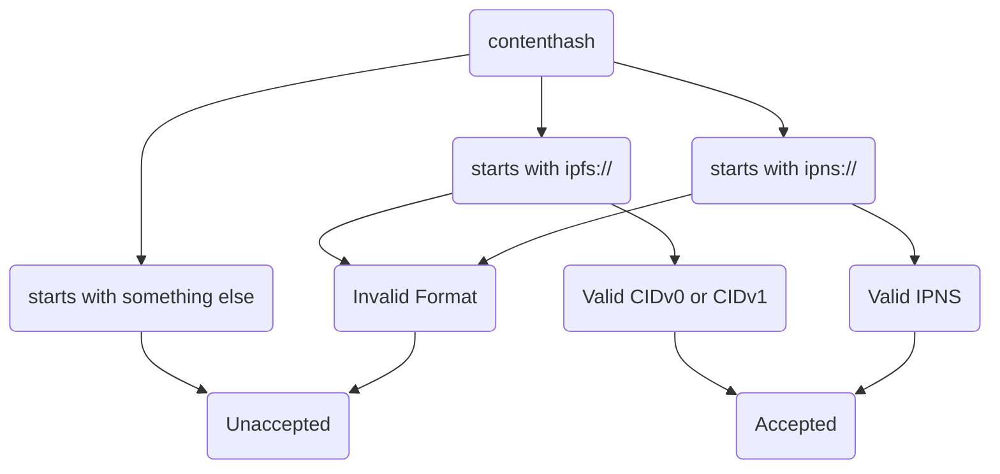

This document describes the logic to verify an entry on the frontend for setting a contenthash.

---



### CID validity checking

**IPFS CID Checking**

Both [CIDv0 and CIDv1](https://docs.ipfs.tech/concepts/content-addressing/#cid-versions) are acceptable, but CIDv1 is recommended as IPFS will use CIDv1 as the default one. If a CID is 46 characters starting with "Qm", it's a CIDv0.

- CIDv0 exmaple: https://cid.ipfs.tech/#QmbWqxBEKC3P8tqsKc98xmWNzrzDtRLMiMPL8wBuTGsMnR
- CIDv1 example: https://cid.ipfs.tech/#bafybeiaysi4s6lnjev27ln5icwm6tueaw2vdykrtjkwiphwekaywqhcjze

[multiformats](https://github.com/multiformats) is used to encode and decode CIDs. Take [js-multiformats](https://github.com/multiformats/js-multiformats) as an example to check IPFS CID validity:

```
import { CID } from 'multiformats/cid'

try {
  parsed = CID.parse(ipfsCid);
} catch (error) {
  console.error("Invalid IPFS path CID Parse " + error);
}
```

**IPNS CID Checking**

IPNS names are pointers (IPNS names) to pointers (IPFS CIDs). As we know, IPFS CIDs are immutable and generated by the content, known for [content addressing](https://docs.ipfs.tech/concepts/ipns/#mutability-in-ipfs). Therefore, IPNS name will be used to prevent changing the ENS contenthash at each time publishing website with Planet.

An IPNS name is essentially the hashed libp2p public key. For more in-deepth details, please refer to [IPNS docs](https://docs.ipfs.tech/concepts/ipns/#how-ipns-works).

- IPNS CID example: https://cid.ipfs.tech/#k51qzi5uqu5dlvj2baxnqndepeb86cbk3ng7n3i46uzyxzyqj2xjonzllnv0v8

Note that, a valid IPNS CID can be both Base32 or Base36 (starts with `k51`). To keep consistent with the practices in IPFS community, IPNS starts with `k51` is enforced for the checking here.
[js-multiformats](https://github.com/multiformats/js-multiformats) example to check IPNS CID validity:

```
import { CID } from 'multiformats/cid'
import { base36 } from 'multiformats/bases/base36'

// check if start with k51
if (ipnsCid.startsWith("k51")) {
  try {
    parsed = CID.parse(ipnsCid, base36);
  } catch (error) {
    console.error("Invalid IPNS path CID Parse " + error);
  }
}
```
