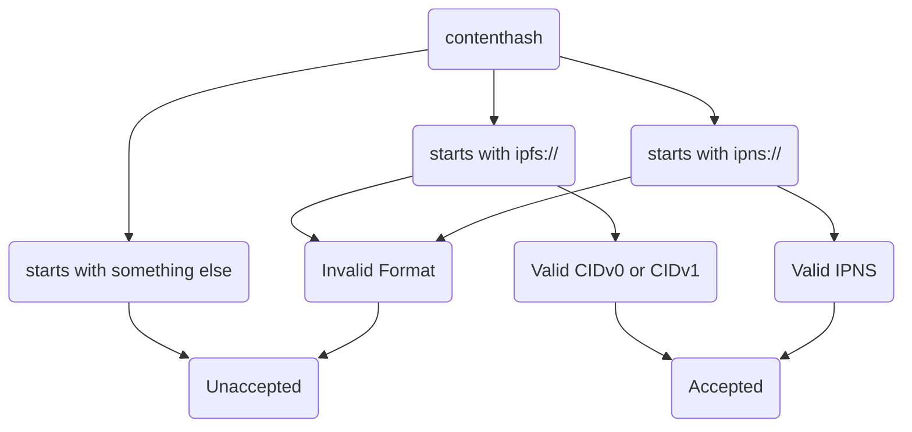

This document describes the logic to verify an entry on the frontend for setting a contenthash.

---

```mermaid
graph TD;
A(contenthash)
A-->D(starts with something else)
D-->N(Unaccepted)
A-->B(starts with ipfs://)
A-->C(starts with ipns://)
B-->F1(Valid CIDv0 or CIDv1)
B-->I
F1-->O(Accepted)
C-->G1(Valid IPNS)
C-->I(Invalid Format)
G1-->O
I-->N
```