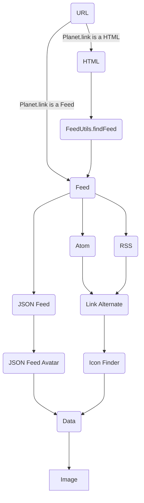

## Strategy to Find the Planet Avatar

The chart below is the happy path. Everything that is not on the path is `nil`.

```mermaid
graph TD;
A(URL)--Planet.link is a Feed-->B(Feed)
A--Planet.link is a HTML-->C(HTML)
C--->FindFeed(FeedUtils.findFeed)
FindFeed--->B
B--->D(JSON Feed)
D--->E(JSON Feed Avatar)
E--->Data
B--->F(RSS)
B--->Atom(Atom)
Atom--->G
F--->G(Link Alternate)
G--->X(Icon Finder)
X--->Data(Data)
Data--->Image
```