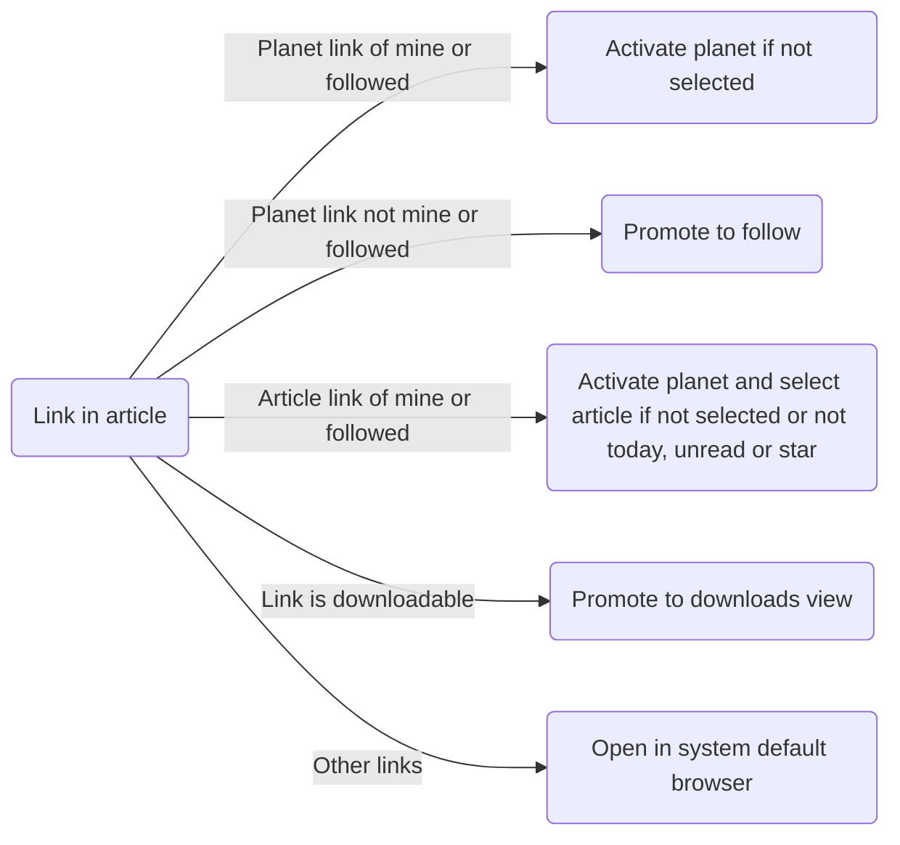

## Redirection of Internal Links in Article View

### Supported Internal Link Types:
- Planet Link:
  - planet://
- Article Link:
  - planet://*/[article-uuid]
  - http://localhost/*/[article-uuid]
  - http://public-gateway/*/[article-uuid]

### Redirection Types

Planet links will be redirect to the planet if:
  - The planet is mine
  - The planet is a following planet
  - The planet is not currently selected

Planet links will promote a following if:
- The planet is not mine or followed
- The planet link is valid

Article links will be redirect to the article and planet if:
- The article is from my planet, and:
  -  Current selected planet is a different planet.
  -  It is not in the article list of selected sidebar (today, unread or star)
- The article is from a following planet, and:
  - Current selected planet is a different planet.
  - It is not in the article list of selected sidebar (today, unread or star)

Article links will be redirect to the article if:
- The article is from my planet, and:
  - It is not the current article
  - It is in the article list of selected sidebar (today, unread or star)
- The article is from a following planet, and:
  - It is not the current article
  - It is in the article list of selected sidebar (today, unread or star)

### Workflow:

